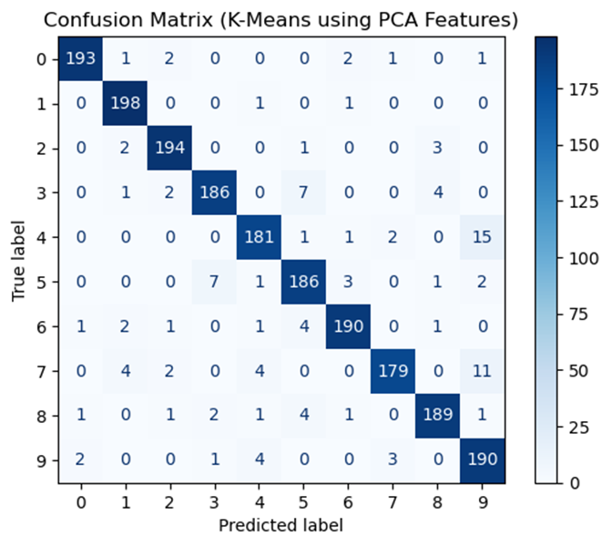
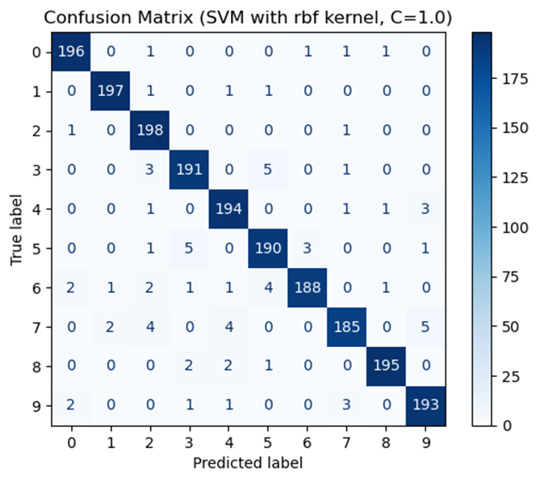

# 🧮 Classical Machine Learning on ReducedMNIST

This project explores classical machine learning models applied to the **ReducedMNIST** dataset — a downsized version of MNIST with:

- **Training set:** 1,000 samples per digit  
- **Test set:** 200 samples per digit  

## 📊 Feature Extraction

Two feature extraction techniques were used to reduce dimensionality:

- **DCT Features:**  
  - Discrete Cosine Transform  
  - Reduced each image to 225 dimensions  

- **PCA Features:**  
  - Principal Component Analysis  
  - Retained enough components to preserve ≥95% of the original variance (from 784 features)

## 🧠 Classification Models

Two types of classifiers were trained on each feature set:

### 1. K-Means Clustering
- Applied with 1, 4, 16, and 32 clusters **per digit class**
- Classification was performed by assigning test samples to the nearest cluster

### 2. Support Vector Machines (SVM)
- Evaluated with:
  - **Linear kernel**
  - **RBF (Radial Basis Function) kernel**

### 📈 Results Summary Table

| **Classifier**        | **Configuration** | **Features**            |              |              |               |              |
|-----------------------|-------------------|--------------------------|--------------|--------------|---------------|--------------|
|                       |                   |                          | **DCT**      |              | **PCA**       |              |
|                       |                   |                          | Accuracy (%) | Time (s)     | Accuracy (%)  | Time (s)     |
| **K-Means Clustering**| Clusters = 1      |                          | 79.30%       | 7.95         | 82.30%        | 7.86         |
|                       | Clusters = 4      |                          | 88.25%       | 8.43         | 89.70%        | 8.42         |
|                       | Clusters = 16     |                          | 92.40%       | 9.03         | 93.70%        | 8.82         |
|                       | Clusters = 32     |                          | 93.80%       | 9.66         | 94.30%        | 9.41         |
| **SVM**               | Linear Kernel     |                          | 91.10%       | 3.70         | 89.55%        | 4.41         |
|                       | RBF Kernel        |                          | 96.35%       | 7.26         | 95.30%        | 8.94         |

**Table 1** shows the results summary for the different combinations of the classifiers used and the feature extraction method, for the k-means clustering method it is noticed that the accuracy increases as the number of clusters increases this is because increasing the number of clusters per class allows K-means to model more complex variations within each digit. With 32 clusters, classes are subdivided into finer groups, leading to more accurate classification. Also, with 1 or 4 clusters, similar digits may overlap in feature space, making it hard for the model to distinguish between them. A higher number of clusters reduces this overlap by providing more specific decision boundaries. However, there is a trade-off when increasing the number of clusters as the processing time also increases and there is a diminishing return after a certain number of clusters where the improvement becomes minimal, and the processing time continues to increase.

For the SVM classifier we used both linear and non-linear kernels for the non-linear kernel we used the RBF kernel (Radial Basis Function). It is observed that the non-linear kernel gets a better accuracy than the linear kernel as a linear kernel works well when the data is linearly separable. However, RBF maps the data to a higher-dimensional space using a Gaussian function. This allows the SVM to separate data that is not linearly separable in the original feature space. The RBF kernel can model complex and non-linear digit patterns, increasing classification accuracy. However, there is a trade-off of increasing computational costs. As shown in **Table 1** the processing time for the RBF kernel is higher than the processing time of the linear kernel.

### 📉 Confusion Matrices

Below are confusion matrices for the **best-performing K-Means** and **best-performing SVM** classifiers.

#### 📌 Confusion Matrix – K-Means using PCA Features

#### 📌 Confusion Matrix – SVM with RBF kernal using DCT Features

**Figure 1** shows the confusion matrix for the best result obtained using the K-means. It is noticed that the classifier confuses the '4' and '9' this is because digits like '4' and '9' share visual features and K-means relies on clustering around centroids, which works best when features (PCA in this case) separate the digits well. PCA reduces dimensionality, which improves speed but may lose some distinctive details, causing confusion between visually similar digits.

**Figure 2** shows the confusion matrix for the best result obtained using the SVM classifier. This confusion matrix has slightly stronger diagonal values and thus better overall performance. SVM with RBF kernel excels at handling non-linearly separable data, which explains better performance.

## 🧩 Key Conclusions

- **PCA** significantly reduced feature dimensionality while preserving important information.
- **RBF SVM** consistently outperformed linear SVM and K-Means in classification accuracy.
- **K-Means** showed improved performance with more clusters.
- Trade-offs exist between **accuracy** and **computation time**, especially with complex kernels like RBF.