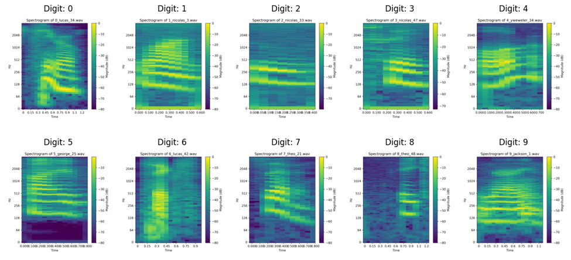

# 🗣 Speech Recognition from Speech Spectrum with Augmentation Experience
This project focuses on building a speech recognition model using spectrograms derived from audio recordings of digits (0–9), applying various augmentation techniques to improve generalization. The base model is a pre-trained **MobileNet**, fine-tuned to classify spectrogram images into 10 classes using the **Google Free Spoken Digit Dataset (FSDD)**.

## 🎯 Project Objectives

- Convert spoken digit audio recordings into log-magnitude spectrograms.
- Train a MobileNet classifier on spectrograms using transfer learning.
- Apply **voice data augmentation** (e.g., time-stretching, noise injection).
- Apply **spectrogram augmentation** (e.g., random width distortion, Gaussian noise).
- Analyze performance impact from different augmentation strategies.


## 📁 Dataset

**Source**: [Google Free Spoken Digit Dataset (FSDD)]  
- 6 speakers
- 3,000 recordings (50 samples of each digit per speaker)
- English digits (0 to 9)
- Sample rate: 8 kHz
- Minimal silence trimming at start/end

### Data Splits
| Split       | Samples |
|-------------|---------|
| Training    | 2400    |
| Validation  | 300     |
| Testing     | 300     |


## 🧪 Spectrogram Generation

- Used **Short-Time Fourier Transform (STFT)** with a window size of 1024.
- Generated **log-magnitude spectrograms** using the `librosa` Python library.
- Labeled and stored each digit in its own subdirectory.




## 🧠 Model Architecture

Used the **MobileNet model** from TensorFlow, leveraging pre-trained ImageNet weights. The model's architecture was enhanced by unfreezing only the last layers and adding custom layers like **average pooling**, **dropout**, and a **SoftMax** output layer for 10 classes (digits 0-9).
 
Model modifications:
- Unfroze last few layers
- Added:
  - Global average pooling
  - Dropout
  - Dense output layer with **Softmax (10 classes)**

```python
# Load the pre-trained MobileNet model
base_model = MobileNet(weights='imagenet', include_top=False, input_shape=(224, 224, 3))
# Unfreeze some of the top layers
base_model.trainable = True
for layer in base_model.layers[:-30]:
    layer.trainable = False
# Add custom classification layers for (10 classes)
x = base_model.output
x = GlobalAveragePooling2D()(x)
x = Dense(256, activation='relu')(x)
x = BatchNormalization()(x)
x = Dropout(0.5)(x)
x = Dense(128, activation='relu')(x)
x = BatchNormalization()(x)
x = Dropout(0.5)(x)
x = Dense(64, activation='relu')(x)
x = BatchNormalization()(x)
x = Dropout(0.5)(x)
output = Dense(10, activation='softmax')(x)     # Multi-class (10) classification 
# Define the final model
model = Model(inputs=base_model.input, outputs=output)
model.compile(optimizer=Adam(learning_rate=0.001),
loss='sparse_categorical_crossentropy', metrics=['accuracy'])
# Print model summary
model.summary()
```


## 🧬 Data Augmentation Experiments

### 🔁 Part B: Voice Data Augmentation

| Augmentation Type                     | Accuracy | Training Samples |
|--------------------------------------|----------|------------------|
| Baseline (no augmentation)           | **98.3%** | 2400             |
| Speed perturbation (±5%)             | 96.0%    | 4800             |
| Random noise (σ = 0.001)             | 95.7%    | 4800             |
| Speed + Noise (σ = 0.005)            | 97.0%    | 4800             |

### 🖼️ Part C: Spectrogram Augmentation

| Augmentation Type                                                    | Accuracy | Training Samples |
|----------------------------------------------------------------------|----------|------------------|
| Horizontal squeeze/expand (5%) + Gaussian noise (σ = 0.02)           | 97.7%    | 4800             |

### 🔄 Part D: Combined Augmentation

| Augmentation Type                      | Accuracy | Training Samples |
|---------------------------------------|----------|------------------|
| Voice + Spectrogram augmentation      | 97.0%    | 9600             |


## 📉 Summary of Results

| Augmentation Strategy | Description | Accuracy |
|-----------------------|-------------|----------|
| Baseline              | No augmentation | **98.3%** |
| Voice only            | Stretch, noise, or both | 95.7–97.0% |
| Spectrogram only      | Width squeeze & noise | 97.7% |
| Combined              | Voice + Spectrogram | 97.0% |


## 🧠 Key Insights

- **Voice augmentation alone** reduced performance slightly.
- **Spectrogram augmentation** yielded the best result next to baseline.
- **Combining augmentations** didn’t outperform spectrogram-only augmentation.
- The **original dataset was high-quality**, and MobileNet with ImageNet weights gave excellent performance even with 2400 samples.
- **More data via augmentation** doesn’t always mean higher accuracy — augmentation must be chosen carefully.

